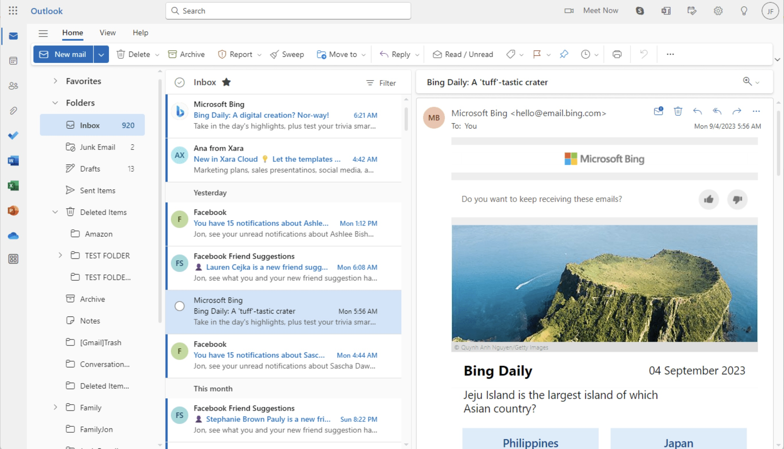

# Hot Media vs. Cold Media  

**Hot Media: _Email_**

Email represents _hot media_ because it is a direct messaging system which limits participation of the user viewing them or the contents involved. 

**Cold Media: _Group Chat_**

Group Chats represent _cold media_ because the viewer's participation is continuously unlimited, and the contents remain fluid and/or changeable. Also involves a more unanimous understanding compared to an email involving 1-on-1 direct interation between the viewer and the content.
